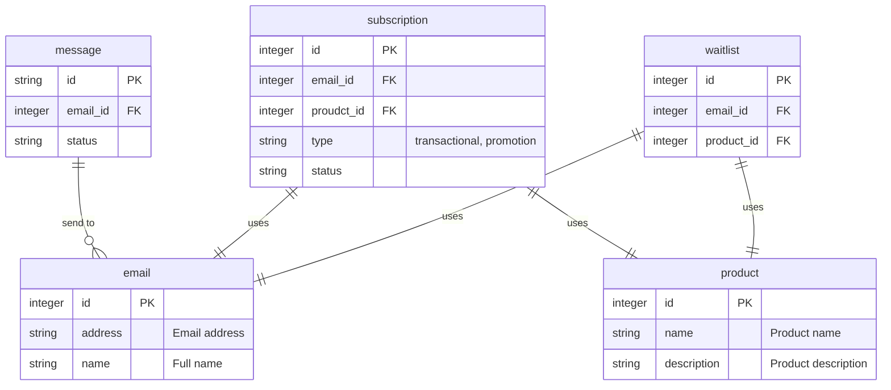

# Mail Sender on Cloudflare Workers

This is a mail sender runs on Cloudflare Workers and send mails through AWS SES API and other mail services.

It exposes the APIs to

* Send emails
* Subscribe to a product with a category
* Unsubscribe from a product



# Setup

## AWS Credentials

```sh
echo $AWS_REGION | pnpm dlx wrangler secret put AWS_REGION
echo $AWS_ACCESS_KEY_ID | pnpm dlx wrangler secret put AWS_ACCESS_KEY_ID
echo $AWS_SECRET_ACCESS_KEY | pnpm dlx wrangler secret put AWS_SECRET_ACCESS_KEY
```

One optional but recommended step is to set up authorization token to protect your worker API.

```sh
openssl rand -base64 24
echo $API_AUTH_TOKEN | pnpm dlx wrangler secret put API_AUTH_TOKEN
```

# Develop

To pull the production D1 tables to local:

```sh
# Export the table DDL
pnpm wrangler d1 export ds-worker --table product --output scripts/create_table_product.sql --no-data --remote

# Export the table data
pnpm wrangler d1 export ds-worker --table product --output scripts/populate_table_product.sql --no-schema --remote
```

Then run against local D1:

```sh
pnpm wrangler d1 execute ds-worker --file scripts/populate_table_product.sql
```

# Deploy

It's recommended to deploy with Work Build once the GitHub integration is configured. A push to `master` will trigger a build on Cloudflare Workers automatically.

It's also very handy to deploy it with wrangler if you just want to test local uncommited changes.

```sh
pnpm dlx wrangler deploy
```

# Usage

## Send a email

```sh
curl -X POST \
  https://$CF_WORKER.$CF_USER.workers.dev/ \
  --header 'X-Auth-Token: API_AUTH_TOKEN' \
  --header 'Content-Type: application/json' \
  --data-raw '{
  "from": "chuck@pixelsai.xyz",
  "to": "support@pixelsai.xyz",
  "subject": "Test email from worker",
  "body": "This is a test email."
}'
```

## Subscribe

```sh
curl -X POST \
  https://$CF_WORKER.$CF_USER.workers.dev/ \
  --header 'X-Auth-Token: API_AUTH_TOKEN' \
  --header 'content-type: application/json' \
  --data '{
  "email": "chuck@pixelsai.xyz",
  "product": "PixelsAI",
  "type": "updates"
}'
```

## Unsubscribe

```sh
curl --X DELETE \
  https://$CF_WORKER.$CF_USER.workers.dev/ \
  --header 'X-Auth-Token: API_AUTH_TOKEN' \
  --header 'content-type: application/json' \
  --data '{
  "email": "chuck@pixelsai.xyz",
  "product": "PixelsAI",
  "type": "updates"
}'
```